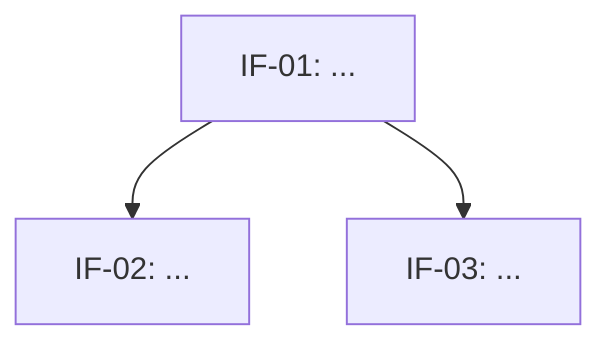

# Doc Format Reference

## docs/ai/overview.md

```markdown
# <Project Name> — System Overview

## Purpose
<2-3 sentences from problem statement>

## Integration Functions

| IF ID | Name | Responsibility | Input | Output |
|---|---|---|---|---|
| IF-01 | ... | ... | ... | ... |

## Key Constraints
- <constraint 1>
- <constraint 2>

## Related Docs
- [Architecture](architecture.md)
- [Tasks](tasks/)
```

---

## docs/ai/architecture.md

```markdown
# Architecture — Dependency Graph



## Notes
- <plain-English dependency explanation>
- <known bottlenecks or ordering constraints>
```

---

## docs/ai/tasks/<UF_ID>.md

```markdown
# <UF_ID>: <UF Name>

**Parent IF:** <IF_ID>
**Status:** TODO | IN_PROGRESS | DONE

## Goal
<One sentence: what this function does.>

## Signature
```python
def uf_name(param: Type) -> ReturnType:
```

## Input / Output Contract
| | Description | Type/Shape | Constraints |
|---|---|---|---|
| Input | ... | ... | ... |
| Output | ... | ... | ... |

## Edge Cases
- <case 1>: <expected behavior>
- <case 2>: <expected behavior>

## Verification
- [ ] <acceptance criterion 1>
- [ ] <acceptance criterion 2>

## Notes
<optional: brief context that constrains the implementation>
```
